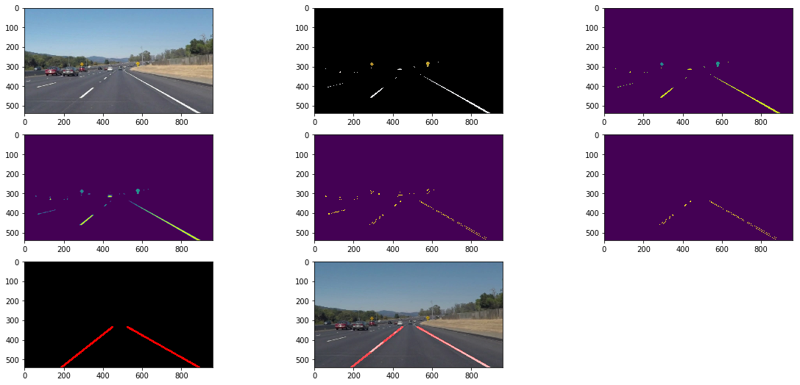

# **Finding Lane Lines on the Road** 

**The goals / steps of this project are the following:**  
Make a pipeline that finds lane lines on the road

### 1. Initial pipeline

Initially, my pipeline consisted of 5 steps which are described as follows:  
- Convert image to greyscale  
- Apply gaussian blurring to smooth image  
- Canny edge detection to detect edges  
- Define region of interest as we are only interested in lane lines which are in front of car  
- Hough transform to find straight lines  

### 2. Potential shortcomings with your current pipeline

The basic pipeline didn't work with the images with yellow lanes. I got an idea from open source community to filter yellow and white pixels before going through the entier pipeline. So, in above pipeline, I just added one more color filter at the beginning.

### 3. Line improvement

As shown in p1.example, lane lines should be pretty smooth so I create another function to draw lines using slope and intercept information. I first calculated the lines for left and right lane based on slope information. Then based on the trapezoid information I smoothened straight line with proper slope and intercept.

### Final oputput
